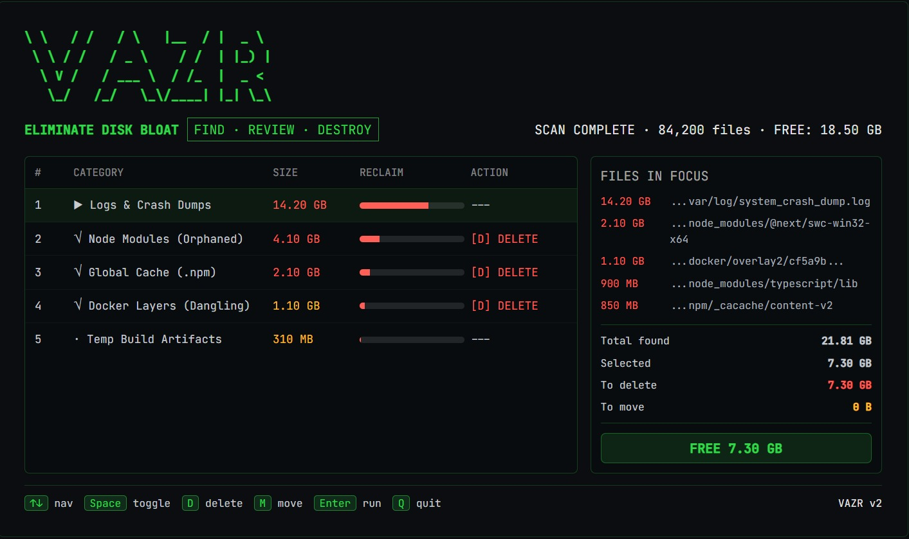

# @lechakrawarthy/vazr

[](https://www.npmjs.com/package/@lechakrawarthy/vazr)
[](https://www.npmjs.com/package/@lechakrawarthy/vazr)
[](https://github.com/lechakrawarthy/vazr/actions/workflows/ci.yml)
[](LICENSE)
[]()

> **Limpieza quirúrgica del disco para quienes saben lo que hacen.**

**Enlaces rápidos:** [Características](#features) · [Inicio rápido](#quick-start) · [Referencia de la CLI](#cli-reference) · [Perfiles](#profiles-v13) · [Exportación](#export-v12) · [Configuración](#config-file) · [Contribuir](CONTRIBUTING.md)

🌍 **Idiomas:** [English](README.md) (predeterminado) · Español

---

## Por qué vazr

Cualquier otro limpiador de disco pregunta *«¿cuánto puedo eliminar?»*
vazr pregunta *«¿qué es lo que realmente no debería estar aquí?»*

Es una perspectiva fundamentalmente diferente. vazr está diseñado para desarrolladores que quieren precisión quirúrgica, no una bomba que lo borre todo. Analiza por categorías, muestra un desglose antes de actuar, permite definir perfiles de limpieza reutilizables y exporta los resultados para pasarlos a otras herramientas. Valores predeterminados seguros. Cero sorpresas.

## Vista previa de la TUI



---

## Inicio rápido

No es necesario instalar nada:

```bash
npx @lechakrawarthy/vazr@latest
```

O instálalo globalmente:

```bash
npm install -g @lechakrawarthy/vazr
vazr
```

---

## Características

### Funciones principales

* **TUI interactiva** — revisión mediante teclado con un desglose del tamaño en tiempo real antes de confirmar cualquier acción
* **5 categorías de análisis** — archivos temporales/caché, descargas antiguas, archivos multimedia grandes, artefactos de desarrollo (node_modules, dist, .cache...), otros archivos grandes
* **Eliminación segura de forma predeterminada** — los archivos eliminados van a la Papelera/Recycle Bin del sistema operativo; la eliminación permanente requiere `--force-delete` y escribir `DELETE` para confirmarla
* **Mover a una unidad externa** — conserva la estructura original de carpetas en el destino
* **`--dry-run`** — análisis y vista previa completos sin ningún efecto secundario
* **Registro de auditoría** — registro con marcas de tiempo de cada operación en `~/.vazr/logs/cleanup.log`
* **Multiplataforma** — Windows, macOS, Linux

### v1.2 — Afilar la hoja

* **Resumen de categorías antes de la TUI** — muestra el tamaño total por categoría y su porcentaje antes de entrar en la revisión interactiva; primero la decisión estratégica, después la táctica
* **Ordenar en la TUI** — pulsa `S` para recorrer los modos de ordenación (tamaño → nombre → cantidad); `--sort` establece el valor predeterminado
* **`--export`** — exporta los resultados del análisis como JSON o CSV sin abrir la TUI; permite pasarlos a otras herramientas o guardarlos en un archivo
* **Detección de antigüedad más inteligente** — las descargas antiguas ahora utilizan `max(mtime, atime)` para que los archivos abiertos recientemente no se marquen por error
* **`--version` mejorado** — muestra `vazr/x.y.z node/vX platform/arch` para facilitar la depuración

### v1.3 — Perfiles

* **Perfiles con nombre** — guarda y reutiliza configuraciones de limpieza en `~/.vazr/profiles/`
* **5 perfiles integrados** — `minimal`, `aggressive`, `media`, `dry-run`, `downloads` — sin configuración necesaria
* **CLI de perfiles** — `vazr profile list / create / export / import / delete`
* **Configuración local del proyecto** — coloca un `.vazr.json` en cualquier directorio y vazr lo aplica automáticamente; puedes incluirlo en un repositorio para que todo el equipo tenga el mismo comportamiento
* **Indicador `--profile`** — `vazr --profile minimal` para aplicar cualquier perfil con nombre; las opciones explícitas de la CLI siempre tienen prioridad

### v1.4 — La actualización de rendimiento

* **Análisis ~1,5 veces más rápidos** — los análisis de artefactos de desarrollo, archivos multimedia grandes, archivos restantes y descargas antiguas recorrían anteriormente de forma independiente los mismos árboles de directorios (hasta 4 veces en una máquina con muchos repositorios); ahora utilizan un único recorrido unificado. Medido en una máquina de desarrollo real: ~58 % menos llamadas a `readdir`, ~50 % menos llamadas a `stat`
* **Estimación del espacio en tiempo real** — la pantalla de análisis ahora muestra un total aproximado de `"~X reclaimable"` a medida que encuentra elementos, en lugar de mostrarlo solamente al terminar el análisis
* **`--exclude <paths>`** — omite rutas específicas durante el análisis (separadas por comas, repetibles o configurables mediante `excludePaths` en un archivo de configuración); las rutas excluidas se eliminan del recorrido antes incluso de ser leídas, por lo que esto también acelera los análisis y no solo los filtra
* **`--verbose`** — muestra exactamente qué raíces se están analizando, qué carpetas se marcan como artefactos de desarrollo y qué rutas se omiten
* **Avisos de actualización** — un aviso de una sola línea, opcional, al final de una ejecución si hay una versión más reciente en npm; nunca bloquea un análisis y falla silenciosamente cuando no hay conexión

---

## Flujos de trabajo comunes

| Objetivo                               | Comando                                        |
| -------------------------------------- | ---------------------------------------------- |
| Vista previa segura                    | `vazr --dry-run`                               |
| Limpieza interactiva completa          | `vazr`                                         |
| Solo node_modules + temporales         | `vazr --profile minimal`                       |
| Todo, de forma agresiva                | `vazr --profile aggressive`                    |
| Exportar análisis a JSON               | `vazr --export json > bloat-report.json`       |
| Exportar análisis a CSV                | `vazr --export csv --export-output report.csv` |
| Mover archivos a otra unidad           | `vazr --target "D:\Archive"`                   |
| Umbrales personalizados                | `vazr --min-media 50 --old-days 14`            |
| Ordenar por nombre en la TUI           | `vazr --sort name`                             |
| Omitir una ruta por completo           | `vazr --exclude "D:\Backups,E:\Media"`         |
| Ver exactamente qué se está analizando | `vazr --verbose`                               |

---

## Referencia de la CLI

```
Usage: vazr [options] [command]

Options:
  -v, --version              vazr/x.y.z  node/vX  platform/arch
  -t, --target <path>        Destination for moved files (e.g. D:\Archive)
  --config <path>            Path to JSON config file
  --log-file <path>          Path to audit log file
  --dry-run                  Preview without touching anything
  --force-delete             Permanent delete — bypasses Trash/Recycle Bin
  --min-media <mb>           Flag media files larger than N MB (default: 100)
  --min-large <mb>           Flag all files larger than N MB (default: 500)
  --old-days <days>          Flag downloads not accessed in N days (default: 60)
  --sort <mode>              Initial TUI sort: size (default) | name | count
  --profile <name>           Apply a named profile (built-in or user-defined)
  --exclude <paths>          Comma-separated paths to skip while scanning (repeatable)
  --verbose                  Print detailed scan activity to stderr
  --export [format]          Output results as json or csv, skip TUI (default: json)
  --export-output <path>     Write export to file instead of stdout
  --no-update-check          Skip checking npm for a newer version on startup
  -h, --help                 Show help

Commands:
  profile                    Manage cleanup profiles
  profile list               List all profiles (built-in + user)
  profile create <name>      Create a new profile interactively
  profile export <name>      Print a profile as JSON (pipe to share)
  profile import <file>      Import a profile from a JSON file (use - for stdin)
  profile delete <name>      Delete a user-defined profile
```

### Controles de teclado de la TUI

| Tecla     | Acción                                               |
| --------- | ---------------------------------------------------- |
| `↑` / `↓` | Navegar por las categorías                           |
| `Space`   | Activar/desactivar la categoría                      |
| `D`       | Establecer la acción como Delete                     |
| `M`       | Establecer la acción como Move (requiere `--target`) |
| `S`       | Recorrer el modo de ordenación (size → name → count) |
| `Enter`   | Confirmar y continuar                                |
| `Q`       | Salir sin realizar cambios                           |

---

## Qué analiza

| Categoría         | Qué                                                                   | Acción predeterminada |
| ----------------- | --------------------------------------------------------------------- | --------------------- |
| Temp & Cache      | Directorios temporales del sistema, caché del navegador, caché de npm | Delete                |
| Old Downloads     | Archivos de Downloads a los que no se ha accedido en N días           | Move to drive         |
| Large Media       | mp4, mkv, iso, avi, mov… por encima del umbral de tamaño              | Move to drive         |
| Dev Artifacts     | node_modules, dist, build, .cache, .next, **pycache**…                | Delete                |
| Other Large Files | Archivos grandes que no pertenecen a las categorías anteriores        | Move to drive         |

---

## Perfiles (v1.3)

Los perfiles permiten definir una vez cómo quieres realizar la limpieza, guardarlo y ejecutarlo repetidamente.

### Perfiles integrados

```bash
vazr --profile minimal      # temp + node_modules only — safe for everyday use
vazr --profile aggressive   # everything, lower thresholds
vazr --profile media        # large media files only
vazr --profile dry-run      # full scan, zero side effects
vazr --profile downloads    # old downloads only
```

### Crea tu propio perfil

```bash
vazr profile create myprofile \
  --description "Weekly dev cleanup" \
  --categories temp,devArt \
  --old-days 30
```

Los perfiles se almacenan en `~/.vazr/profiles/<name>.json`. Puedes editarlos directamente.

### Compartir perfiles entre máquinas

```bash
# Export
vazr profile export myprofile > myprofile.json

# Import on another machine
vazr profile import myprofile.json

# Or pipe directly
vazr profile export myprofile | ssh otherbox "vazr profile import -"
```

### Configuración local del proyecto

Coloca un `.vazr.json` en cualquier directorio del proyecto (o en cualquier directorio padre hasta 8 niveles):

```json
{
  "scanCategories": ["temp", "devArt"],
  "oldDays": 30,
  "dryRun": false
}
```

vazr lo detecta automáticamente y lo aplica. Inclúyelo en el repositorio para que todos los desarrolladores del equipo tengan un comportamiento de limpieza coherente.

---

## Exportación (v1.2)

Omite por completo la TUI y exporta los resultados sin procesar del análisis:

```bash
# JSON to stdout
vazr --export json > bloat-report.json

# CSV to file
vazr --export csv --export-output report.csv

# Pipe into jq
vazr --export | jq '.categories[] | {label, totalSizeBytes}'

# Combine with a profile
vazr --profile aggressive --export json > aggressive-scan.json
```

Estructura de salida JSON:

```json
{
  "generated": "2026-05-30T...",
  "meta": { "version": "1.3.0", "scanDurationMs": 4200, ... },
  "categories": [
    {
      "key": "devArt",
      "label": "Dev Artifacts (node_modules…)",
      "count": 12,
      "totalSizeBytes": 4294967296,
      "items": [{ "path": "/home/user/projects/old/node_modules", "sizeBytes": 512000000 }]
    }
  ]
}
```

---

## Archivo de configuración

Establece valores predeterminados persistentes en JSON. La configuración tiene una prioridad inferior a las opciones de la CLI.

```json
{
  "target": "H:\\Archive",
  "minMediaMB": 100,
  "minLargeMB": 500,
  "oldDays": 60,
  "logFile": "C:\\Users\\you\\.vazr\\logs\\cleanup.log",
  "forceDelete": false,
  "excludePaths": ["H:\\Archive", "D:\\Backups"]
}
```

Orden de búsqueda de la configuración (de mayor a menor prioridad):

1. Opción `--config <path>` de la CLI
2. Variable de entorno `VAZR_CONFIG`
3. `.vazr.json` en el directorio actual (o cualquier directorio padre, hasta 8 niveles)
4. `~/.vazr/config.json`
5. `~/.vazr.json`

---

## Modelo de seguridad

* **Las eliminaciones predeterminadas van a la Papelera/Recycle Bin** — puedes recuperar los errores
* **`--force-delete`** omite la Papelera y requiere escribir `DELETE` en el mensaje de confirmación
* **Rutas protegidas** — los directorios del sistema nunca se modifican independientemente de lo que contengan
* **`--dry-run`** — cero efectos secundarios; analiza y muestra los resultados, pero no hace nada

---

## Registro de auditoría

Cada operación se registra en `~/.vazr/logs/cleanup.log` con marcas de tiempo. Puedes cambiar la ubicación mediante `--log-file`.

---

## Solución de problemas

| Problema                                | Solución                                                                                         |
| --------------------------------------- | ------------------------------------------------------------------------------------------------ |
| No se encuentra nada                    | Reduce `--min-media`, `--min-large` o `--old-days`                                               |
| La unidad de destino no está disponible | Elige otra unidad cuando se solicite o ejecuta el modo de solo eliminación                       |
| Errores de permisos                     | Ejecuta desde un shell que tenga acceso a los archivos de destino                                |
| Problemas con las rutas de Windows      | Pon las rutas entre comillas: `--target "D:\Archive"`                                            |
| No se encuentran las descargas antiguas | Asegúrate de que exista la carpeta de descargas y de que el umbral de días no sea demasiado alto |

---

## Contribuir

vazr es de código abierto y acepta contribuciones.

1. **Informar de errores** → [Abrir un issue](https://github.com/lechakrawarthy/vazr/issues)
2. **Sugerir funciones** → [Iniciar una discusión](https://github.com/lechakrawarthy/vazr/discussions)
3. **Escribir código** → Lee [CONTRIBUTING.md](CONTRIBUTING.md) y después [DEVELOPMENT.md](DEVELOPMENT.md)
4. **¿Es tu primera contribución?** → Busca las etiquetas de [good first issue](https://github.com/lechakrawarthy/vazr/issues?q=label%3A%22good+first+issue%22)

**Problemas de seguridad** — infórmalos mediante [SECURITY.md](SECURITY.md), no mediante issues públicos.

---

## Licencia

MIT
