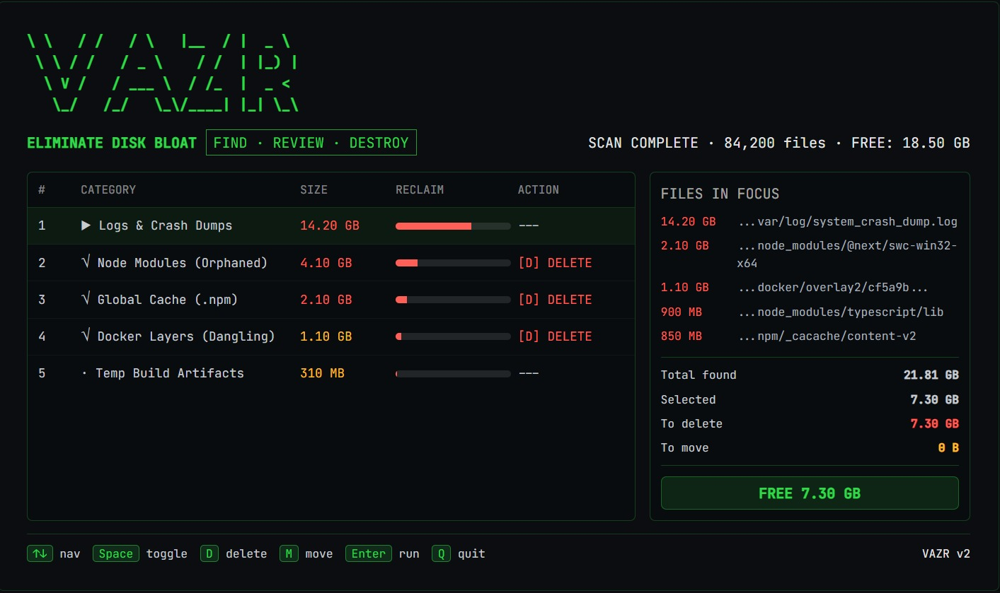

# @lechakrawarthy/vazr

[](https://www.npmjs.com/package/@lechakrawarthy/vazr)
[](https://www.npmjs.com/package/@lechakrawarthy/vazr)
[](https://github.com/lechakrawarthy/vazr/actions/workflows/ci.yml)
[](LICENSE)
[]()

> **Surgical disk cleanup for people who know what they're doing.**

**Quick Links:** [Features](#features) · [Quick Start](#quick-start) · [CLI Reference](#cli-reference) · [Profiles](#profiles-v13) · [Export](#export-v12) · [Config](#config-file) · [Contributing](CONTRIBUTING.md)

---

## Why vazr

Every other disk cleaner asks *"how much can I delete?"*  
vazr asks *"what actually shouldn't be here?"*

That's a fundamentally different frame. vazr is built for developers who want surgical precision — not a blunt nuke. It scans by category, shows you a breakdown before you act, lets you define reusable cleanup profiles, and exports results to pipe into other tools. Safe defaults. Zero surprises.

## TUI Preview



---

## Quick Start

No install needed:

```bash
npx @lechakrawarthy/vazr
```

Or install globally:

```bash
npm install -g @lechakrawarthy/vazr
vazr
```

---

## Features

### Core
- **Interactive TUI** — keyboard-driven review with live size breakdown before you commit to anything
- **5 scan categories** — temp/cache, old downloads, large media, dev artifacts (node_modules, dist, .cache...), other large files
- **Safe delete by default** — deletes go to OS Trash/Recycle Bin; permanent delete requires `--force-delete` and typing `DELETE` to confirm
- **Move to external drive** — preserves original folder structure on the destination
- **`--dry-run`** — full scan and preview with zero side effects
- **Audit log** — timestamped record of every operation at `~/.vazr/logs/cleanup.log`
- **Cross-platform** — Windows, macOS, Linux

### v1.2 — Sharpen the Blade
- **Category summary before TUI** — see total size per category and percentage share before entering the interactive review; strategic decision before tactical one
- **Sort in TUI** — press `S` to cycle sort modes (size → name → count); `--sort` sets the default
- **`--export`** — dump scan results as JSON or CSV without opening the TUI; pipe into other tools or save to file
- **Smarter age detection** — old downloads now use `max(mtime, atime)` so recently-opened files aren't falsely flagged
- **Enhanced `--version`** — reports `vazr/x.y.z node/vX platform/arch` for easier debugging

### v1.3 — Profiles
- **Named profiles** — save and reuse cleanup configurations in `~/.vazr/profiles/`
- **5 built-in profiles** — `minimal`, `aggressive`, `media`, `dry-run`, `downloads` — zero setup needed
- **Profile CLI** — `vazr profile list / create / export / import / delete`
- **Project-local config** — drop a `.vazr.json` in any directory and vazr auto-applies it; commit it to a repo so the whole team gets the same behavior
- **`--profile`** flag — `vazr --profile minimal` to apply any named profile; explicit CLI flags always win

---

## Common Workflows

| Goal | Command |
|---|---|
| Safe preview | `vazr --dry-run` |
| Full interactive cleanup | `vazr` |
| Only node_modules + temp | `vazr --profile minimal` |
| Everything, aggressive | `vazr --profile aggressive` |
| Export scan to JSON | `vazr --export json > bloat-report.json` |
| Export scan to CSV | `vazr --export csv --export-output report.csv` |
| Move files to another drive | `vazr --target "D:\Archive"` |
| Custom thresholds | `vazr --min-media 50 --old-days 14` |
| Sort by name in TUI | `vazr --sort name` |

---

## CLI Reference

```
Usage: vazr [options] [command]

Options:
  -v, --version              vazr/x.y.z  node/vX  platform/arch
  -t, --target <path>        Destination for moved files (e.g. D:\Archive)
  --config <path>            Path to JSON config file
  --log-file <path>          Path to audit log file
  --dry-run                  Preview without touching anything
  --force-delete             Permanent delete — bypasses Trash/Recycle Bin
  --min-media <mb>           Flag media files larger than N MB (default: 100)
  --min-large <mb>           Flag all files larger than N MB (default: 500)
  --old-days <days>          Flag downloads not accessed in N days (default: 60)
  --sort <mode>              Initial TUI sort: size (default) | name | count
  --profile <name>           Apply a named profile (built-in or user-defined)
  --export [format]          Output results as json or csv, skip TUI (default: json)
  --export-output <path>     Write export to file instead of stdout
  -h, --help                 Show help

Commands:
  profile                    Manage cleanup profiles
  profile list               List all profiles (built-in + user)
  profile create <name>      Create a new profile interactively
  profile export <name>      Print a profile as JSON (pipe to share)
  profile import <file>      Import a profile from a JSON file (use - for stdin)
  profile delete <name>      Delete a user-defined profile
```

### TUI keyboard controls

| Key | Action |
|---|---|
| `↑` / `↓` | Navigate categories |
| `Space` | Toggle category on/off |
| `D` | Set action to Delete |
| `M` | Set action to Move (requires `--target`) |
| `S` | Cycle sort mode (size → name → count) |
| `Enter` | Confirm and proceed |
| `Q` | Quit without changes |

---

## What It Scans

| Category | What | Default Action |
|---|---|---|
| Temp & Cache | OS temp dirs, browser cache, npm cache | Delete |
| Old Downloads | Files in Downloads not accessed in N days | Move to drive |
| Large Media | mp4, mkv, iso, avi, mov… above size threshold | Move to drive |
| Dev Artifacts | node_modules, dist, build, .cache, .next, __pycache__… | Delete |
| Other Large Files | Catch-all for large files not caught above | Move to drive |

---

## Profiles (v1.3)

Profiles let you define how you want to clean once, save it, and run it repeatedly.

### Built-in profiles

```bash
vazr --profile minimal      # temp + node_modules only — safe for everyday use
vazr --profile aggressive   # everything, lower thresholds
vazr --profile media        # large media files only
vazr --profile dry-run      # full scan, zero side effects
vazr --profile downloads    # old downloads only
```

### Create your own

```bash
vazr profile create myprofile \
  --description "Weekly dev cleanup" \
  --categories temp,devArt \
  --old-days 30
```

Profiles are stored in `~/.vazr/profiles/<name>.json`. You can edit them directly.

### Share profiles across machines

```bash
# Export
vazr profile export myprofile > myprofile.json

# Import on another machine
vazr profile import myprofile.json

# Or pipe directly
vazr profile export myprofile | ssh otherbox "vazr profile import -"
```

### Project-local config

Drop a `.vazr.json` in any project directory (or any parent up to 8 levels):

```json
{
  "scanCategories": ["temp", "devArt"],
  "oldDays": 30,
  "dryRun": false
}
```

vazr auto-detects it and applies it. Commit it to the repo so every developer on the team gets consistent cleanup behavior.

---

## Export (v1.2)

Skip the TUI entirely and dump raw scan results:

```bash
# JSON to stdout
vazr --export json > bloat-report.json

# CSV to file
vazr --export csv --export-output report.csv

# Pipe into jq
vazr --export | jq '.categories[] | {label, totalSizeBytes}'

# Combine with a profile
vazr --profile aggressive --export json > aggressive-scan.json
```

JSON output shape:
```json
{
  "generated": "2026-05-30T...",
  "meta": { "version": "1.3.0", "scanDurationMs": 4200, ... },
  "categories": [
    {
      "key": "devArt",
      "label": "Dev Artifacts (node_modules…)",
      "count": 12,
      "totalSizeBytes": 4294967296,
      "items": [{ "path": "/home/user/projects/old/node_modules", "sizeBytes": 512000000 }]
    }
  ]
}
```

---

## Config File

Set persistent defaults in JSON. Config is applied at lower priority than CLI flags.

```json
{
  "target": "H:\\Archive",
  "minMediaMB": 100,
  "minLargeMB": 500,
  "oldDays": 60,
  "logFile": "C:\\Users\\you\\.vazr\\logs\\cleanup.log",
  "forceDelete": false
}
```

Config search order (highest priority first):
1. `--config <path>` CLI flag
2. `VAZR_CONFIG` environment variable
3. `.vazr.json` in current directory (or any parent, up to 8 levels)
4. `~/.vazr/config.json`
5. `~/.vazr.json`

---

## Safety Model

- **Default deletes go to Trash/Recycle Bin** — you can recover mistakes
- **`--force-delete`** bypasses the Trash and requires typing `DELETE` at a confirmation prompt
- **Protected paths** — system directories are never touched regardless of what's in them
- **`--dry-run`** — zero side effects; scans and shows results, does nothing

---

## Audit Log

Every operation is logged to `~/.vazr/logs/cleanup.log` with timestamps. Override with `--log-file`.

---

## Troubleshooting

| Problem | Fix |
|---|---|
| Nothing found | Lower `--min-media`, `--min-large`, or `--old-days` |
| Target drive unavailable | Choose another drive at the prompt or run in delete-only mode |
| Permission errors | Run from a shell that has access to the target files |
| Windows path issues | Wrap paths in quotes: `--target "D:\Archive"` |
| Old downloads not found | Ensure the downloads folder exists and the days threshold isn't too high |

---

## Contributing

vazr is open source and welcomes contributions.

1. **Report bugs** → [Open an issue](https://github.com/lechakrawarthy/vazr/issues)
2. **Suggest features** → [Start a discussion](https://github.com/lechakrawarthy/vazr/discussions)
3. **Write code** → Read [CONTRIBUTING.md](CONTRIBUTING.md) then [DEVELOPMENT.md](DEVELOPMENT.md)
4. **First contribution?** → Look for [good first issue](https://github.com/lechakrawarthy/vazr/issues?q=label%3A%22good+first+issue%22) labels

**Security issues** — please report via [SECURITY.md](SECURITY.md), not public issues.

---

## License

MIT
